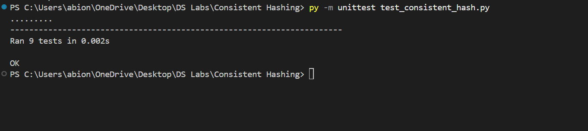

# Consistent Hashing Implementation

This project implements a **Consistent Hashing** algorithm for distributing client requests across multiple server replicas in a distributed system.

Consistent hashing minimizes the number of requests that need to be reassigned whenever a server is added or removed, making it an efficient and scalable approach for load balancing. This implementation follows the specifications provided in the Distributed Systems assignment.


## Assignment Specifications

The implementation uses the following parameters:

| Parameter | Value |
|-----------|------:|
| Number of Physical Servers (N) | 3 |
| Number of Hash Ring Slots | 512 |
| Number of Virtual Servers per Physical Server (K) | 9 |
| Collision Resolution | Linear Probing |

### Request Hash Function

```
H(i) = i² + 2i + 17
```

### Virtual Server Hash Function

```
Φ(i,j) = i² + j² + 2j + 25
```

---

# Features

- 512-slot circular hash ring
- Three physical servers
- Nine virtual servers per physical server
- Linear probing for collision resolution
- Clockwise request assignment
- Server addition
- Server removal
- Hash ring utilization statistics
- Unit testing

---

# Project Structure

```text
Task2-Consistent-Hashing/
│
├── consistent_hash.py
├── server.py
├── request.py
├── main.py
├── demo.py
├── test_consistent_hash.py
├── README.md
├── .gitignore
├── hash_ring.png
├── demo_output.png
└── tests.png
```

# Technologies Used

- Python 3
- Object-Oriented Programming (OOP)
- Python unittest framework

# Design Choices

## Consistent Hash Ring

A circular hash ring containing **512 slots** is used to distribute requests among servers.

Instead of storing each physical server only once, every physical server is represented by **nine virtual servers** placed at different positions on the ring. This provides a more balanced distribution of requests and reduces hotspots.

## Virtual Servers

Virtual servers improve load balancing because requests are spread across multiple positions on the ring rather than clustering around a single server location.

## Collision Resolution

Two virtual servers may hash to the same slot.

This implementation uses **Linear Probing**, where the algorithm checks the next available slot until an empty position is found.

## Request Mapping

Each client request is hashed using the specified request hash function.

The request is assigned to the nearest virtual server encountered while moving clockwise around the ring.

# Running the Project

Run the main demonstration.

```bash
py main.py
```

For a simplified demonstration suitable for presentations:

```bash
py demo.py
```

# Running the Tests

Run all unit tests using:

```bash
py -m unittest test_consistent_hash.py
```

Expected output:

```text
.........
----------------------------------------------------------------------
Ran 9 tests in 0.002s

OK
```

# Demonstration

The following screenshots demonstrate the successful implementation.

## 1. Hash Ring Initialization

This screenshot shows the creation of the consistent hash ring and placement of virtual servers.


---

## 2. Program Output

The demonstration program shows:

- Adding servers
- Mapping requests
- Removing a server
- Adding another server
- Updated request mapping


---

## 3. Unit Tests

The project includes automated unit tests covering the major functionalities of the implementation.

The tests verify:

- Request hashing
- Server hashing
- Virtual server creation
- Adding servers
- Removing servers
- Request mapping
- Ring utilization



# Testing Summary

The project includes unit tests for the following functionalities:

- Request hash function
- Virtual server hash function
- Adding a server
- Removing a server
- Virtual server creation
- Request assignment
- Occupied slot calculation
- Hash ring utilization


